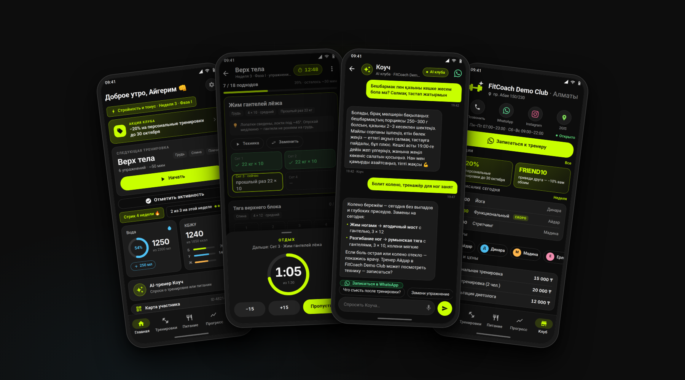
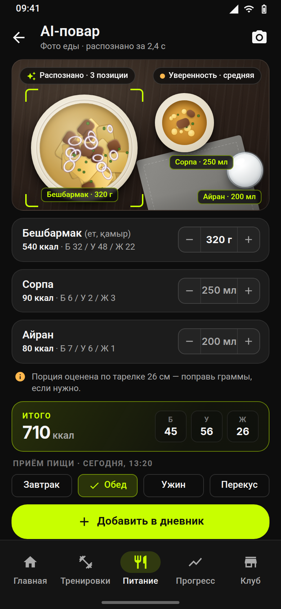
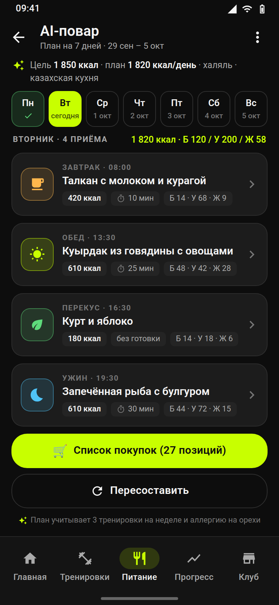

# FitCoach AI — white-label фитнес-приложение с AI-тренером для фитнес-клубов Казахстана

> Приложение клуба в кармане у каждого клиента: персональные программы, дневник тренировок и питания,
> AI-тренер на русском и казахском, AI-повар (план питания, список покупок, фото еды → КБЖУ), запись к тренеру в WhatsApp,
> акции клуба и карточки для Instagram Stories с логотипом клуба. Один файл конфигурации — один клуб. Android, Kotlin, Jetpack Compose.

<p align="center">
  
</p>

## Что получает клуб

| Для клиентов клуба | Для владельца |
|---|---|
| Онбординг за 60 секунд: цель, уровень, ограничения по здоровью → персональные КБЖУ, вода и программа | Приложение под брендом клуба (иконка, цвета, логотип) за 15 минут, публикация в Google Play под аккаунтом клуба |
| 3 программы по 12 недель с гибким графиком, ввод веса и повторов, «прошлый раз», таймер отдыха, замена упражнения | AI-тренер знает клуб и мягко предлагает персональные тренировки и диетолога — лиды приходят в WhatsApp с пометкой «из приложения» |
| AI-тренер: отвечает на русском и казахском, учитывает ограничения (спина, колени, давление…), не ставит диагнозов | Карточки «Поделиться в Stories» с логотипом клуба и промокодом «приведи друга» — бесплатный охват в Instagram |
| AI-повар: план питания на 3/5/7 дней под цели КБЖУ — казахская или домашняя кухня, халяль, бюджет, исключения; из плана — список покупок по отделам магазина с напоминанием «пора за покупками» | Планы и списки хранятся на телефоне; AI-повар работает через тот же прокси клуба с отдельными дневными лимитами на планы и фото — бюджет под контролем |
| Фото еды → КБЖУ: сфотографировал тарелку — получил блюда, граммы и калории, поправил, одним тапом добавил в дневник | Фото не хранится ни на прокси, ни в приложении — только результат в дневнике; в демо-режиме AI-повар показывает готовый план и разбор фото без интернета |
| Вкладка «Клуб»: контакты, 2GIS, расписание групповых, тренеры, услуги и цены, акции | Контент вкладки «Клуб» и акции клуб правит сам в Google Sheets — без разработчика; о новой акции клиентам приходит уведомление |
| Карта участника (код + QR), стрики, достижения, график веса, напоминания о воде и тренировках | Ключ AI — у клуба, лимиты на устройство и общий дневной лимит защищают бюджет; демо-режим работает без интернета |

Чего **нет** в v1 (продаётся как опционы «фазы 2»): iOS, аккаунты и синхронизация, интеграция с 1С:Фитнес клуб, панель владельца, серверные push-уведомления. См. `docs/sales/`.

## AI-повар (с 1.1.0)

<p align="center">
  
  &nbsp;&nbsp;
  
</p>

- **План питания** на 3/5/7 дней под цели профиля (ккал/БЖУ): кухня (казахская / домашняя / любая), халяль, бюджет, исключения и аллергии, 3–5 приёмов в день, «готовлю заранее на 2 дня». Каждый приём — ингредиенты с граммами, КБЖУ, 2–4 шага, время готовки; любой приём добавляется в дневник одним тапом. Язык плана = язык интерфейса (RU/KK).
- **Список покупок** собирается из плана: отделы магазина (мясо/рыба, молочное, крупы и бакалея, овощи и фрукты, прочее), количества в г/кг/шт/л, дубликаты объединены; чекбоксы «куплено», «Поделиться» текстом в WhatsApp, напоминание «пора за покупками» в выбранный день недели и время (локально, WorkManager).
- **Фото еды → КБЖУ**: камера или галерея → уменьшение до 1024 px на устройстве → прокси клуба → Claude (vision) → блюда с граммами, КБЖУ и уверенностью; граммы правятся, КБЖУ пересчитывается, «Добавить в дневник» (по записи на блюдо, значок 📷 в дневнике). Оценка по фото — ориентир (±20–30 %), не замена весам.
- Работает через прокси клуба (`/v1/meal-plan`, `/v1/food-photo`, структурированный вывод; лимиты по умолчанию — 3 плана и 20 фото в день на устройство). Без прокси или интернета — демо-заглушки: готовый 3-дневный план с казахской кухней и фиксированный разбор фото с пометкой «демо-оценка».

## Структура репозитория

```
app/                 Android-приложение (Kotlin, Compose, Hilt, Room)
brands/              Конфигурации клиентов: один .properties = один клуб (= product flavor)
proxy/               AI-прокси (Cloudflare Worker): ключ Anthropic хранится у клуба, лимиты, токен приложения; чат, план питания, фото еды
docs/WHITE_LABEL.md  Новый клиент за 15 минут (бренд, логотип, контент, прокси, сборка)
docs/RELEASE.md      Подпись, Google Play, AppGallery, обновления
docs/CLUB_CONTENT.md Как клуб правит акции/расписание/тренеров через Google Sheets
docs/PRIVACY_POLICY_ru.md  Шаблон политики конфиденциальности (закон РК о персональных данных)
docs/sales/          Комплект для продажи: 90-дневный план, цены в тенге, шаблоны сообщений и писем,
                     сценарий демо, отработка возражений, Instagram-стратегия, КП, юридический пакет, лендинг, ROI-калькулятор
ARCHITECTURE.md      Архитектура кода и точки расширения
```

## Быстрый старт (разработчик)

Требования: JDK 17, Android SDK 35 (`local.properties` → `sdk.dir=…`). Gradle wrapper в репозитории.

```bash
./gradlew :app:assembleDemoDebug          # demo-бренд из brands/demo.properties
./gradlew :app:testDemoDebugUnitTest      # unit-тесты (калькулятор целей, программы, стрики, AI-санитайзер, JSON клуба, AI-повар)
./gradlew assembleDebug                   # все бренды сразу
adb install app/build/outputs/apk/demo/debug/app-demo-debug.apk
```

В настройках приложения: **«Загрузить 3 недели» (Настройки → Демо-данные)** — 3 недели истории для презентации; **«Демо-режим AI (офлайн)»** — офлайн-ответы тренера и готовый план/разбор фото AI-повара, если нет прокси или интернета.

## Новый клуб за 15 минут

1. `cp brands/_template.properties.example brands/<клуб>.properties` и заполнить (имя, applicationId, цвета, адрес, WhatsApp, Instagram, 2GIS).
2. Логотип → `app/src/<клуб>/res/drawable/brand_logo.xml|png`, иконка → `ic_launcher_foreground`.
3. Контент → `app/src/<клуб>/assets/club/club.json` (или Google Sheet, см. `docs/CLUB_CONTENT.md`).
4. AI-прокси → `proxy/README.md` → `aiProxyUrl`, `aiProxyToken`.
5. `./gradlew :app:assemble<Клуб>Release` → `docs/RELEASE.md`.

Подробно: `docs/WHITE_LABEL.md`.

## Технологии

Kotlin 2.0 · Jetpack Compose (Material 3) · Hilt · Room · WorkManager · Retrofit/OkHttp + kotlinx.serialization · ZXing (QR) · Cloudflare Workers + `@anthropic-ai/sdk` + zod (прокси; структурированный вывод для AI-повара) · Claude `claude-opus-5` (текст и vision; модель настраивается одной переменной, дешевле — `claude-sonnet-5`) · GitHub Actions (сборка всех брендов + тесты).

## Лицензия и продажа

Исходный код передаётся клубу по лицензионному договору (пакеты «Старт / Клуб / Эксклюзив», см. `docs/sales/02_ПРАЙС_И_ПАКЕТЫ.md`). Бренд, логотипы и контент клуба принадлежат клубу.
